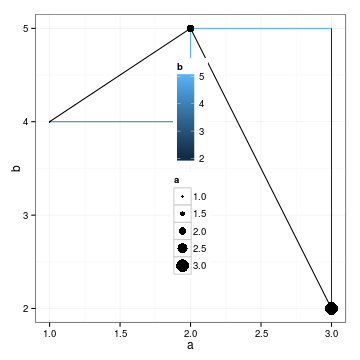
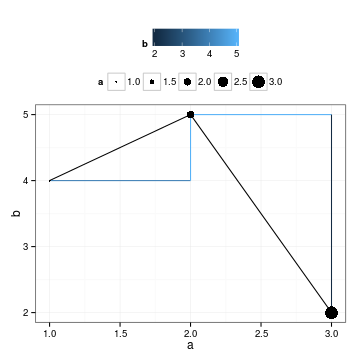

ggplot2
====


# Plotting in ggplot2
* http://ggplot2.org/
* http://docs.ggplot2.org/current/
* http://www.ceb-institute.org/bbs/wp-content/uploads/2011/09/handout_ggplot2.pdf --> cheat sheet
* http://inundata.org/2013/04/10/a-quick-introduction-to-ggplot2/ 
** a nice presentation introducing ggplot2, includes the basics of plyr and reshape packages (the author calls them the swiss army knife of R)
** includes a lot more than just the basics, all code is accompanied by the corresponding figures

# Basic plotting

Includes a nice theme and showcases some often-used possibilities of ggplot2 

### Legend Positioning


```r
a = c(1, 2, 3)
b = c(4, 5, 2)
df = data.frame(cbind(a, b))
require(ggplot2)
```

```
## Loading required package: ggplot2
```

```r
theme_set(theme_bw())
p = ggplot(df)
p = p + geom_line(aes(x = a, y = b))
p = p + geom_step(aes(x = a, y = b, color = b))
p = p + geom_point(aes(x = a, y = b, size = a))
print(p)
```

 

```r

p = p + theme(legend.position = c(0.5, 0.5))
print(p)
```

 

```r

p = p + theme(legend.position = "top")
print(p)
```

 

```r

p = p + theme(legend.position = "bottom")
print(p)
```

 


